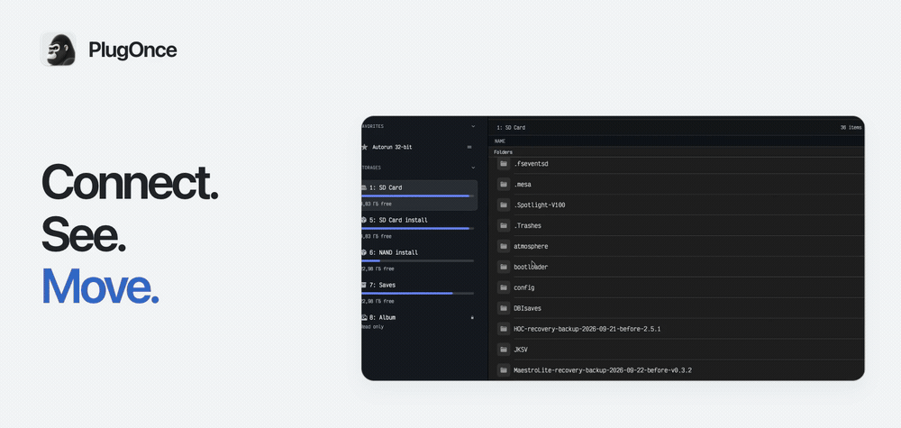

**English** · [Русский](README.ru.md)

# PlugOnce

A native macOS app for moving files between your Mac and Nintendo Switch over USB. Browse DBI storage, send packages, import captures and keep a copy of your saves.

  <a href="#overview"><picture>
      <source media="(prefers-reduced-motion: reduce) and (prefers-color-scheme: dark)" srcset="assets/hero-en-dark.png">
      <source media="(prefers-reduced-motion: reduce)" srcset="assets/hero-en.png">
      <source media="(prefers-color-scheme: dark)" srcset="assets/hero-en-dark.gif">
      
    </picture></a>

  <a href="https://plugonce.foxset.tech/?lang=en"><picture><source media="(prefers-color-scheme: dark)" srcset="assets/download-en-dark.svg"></picture></a>
  <a href="https://plugonce.foxset.tech/guide?lang=en"><picture><source media="(prefers-color-scheme: dark)" srcset="assets/guide-en-dark.svg"></picture></a>
  <a href="https://forum.foxset.tech/"><picture><source media="(prefers-color-scheme: dark)" srcset="assets/support-en-dark.svg"></picture></a>

macOS 12+ · Apple Silicon + Intel · USB / DBI MTP · English / Русский

<a href="assets/hero-en.png">Still cover</a>

> **Public beta.** The current download is not notarized by Apple. Check the version and release information on the [official website](https://plugonce.foxset.tech/?lang=en).

## Watch the overview

49 seconds · Recorded in PlugOnce.

https://github.com/user-attachments/assets/2752efdf-2ac2-4db7-ab00-dee16095b9c1

## Files, packages, captures and saves

<table>
  <tr>
    <td width="50%" valign="top">
      
      <h3>Files</h3>
      
Open your SD card, find a folder and move files between Mac and Switch.

      <a href="DEMOS.md#demo-files">▶ Watch · 0:15</a>
    </td>
    <td width="50%" valign="top">
      
      <h3>Packages</h3>
      
Send NSP, NSZ, XCI and XCZ packages to DBI with progress for each transfer.

      <a href="DEMOS.md#demo-packages">▶ Watch · 0:16</a>
    </td>
  </tr>
  <tr>
    <td width="50%" valign="top">
      
      <h3>Screenshots & videos</h3>
      
Browse screenshots and videos, use Quick Look and import new captures.

      <a href="DEMOS.md#demo-captures">▶ Watch · 0:14</a>
    </td>
    <td width="50%" valign="top">
      
      <h3>Save backups</h3>
      
Copy saves exposed by DBI to a dated folder on your Mac.

      <a href="DEMOS.md#demo-saves">▶ Watch · 0:17</a>
    </td>
  </tr>
</table>

## Connected in three steps

1. [Download PlugOnce](https://plugonce.foxset.tech/?lang=en) and open it on a Mac running **macOS 12 or later**. Apple Silicon and Intel are supported.
2. On your Switch, open **DBI → Run MTP responder**. Connect it to your Mac with a USB data cable.
3. Choose a storage in PlugOnce. Browse folders, drag in files or copy selected items to your Mac.

**Only need screenshots and videos?** Use the Switch system option **System Settings → Data Management → Manage Screenshots and Videos → Copy to a Computer via USB Connection**. This album workflow does not require DBI.

[Full connection guide →](https://plugonce.foxset.tech/guide?lang=en)

## A few useful extras

- **Favorites and keyboard shortcuts** for folders and actions you use often.
- **Device Doctor** to see which connection step needs attention.
- **Local Wi-Fi transfer** through a browser while PlugOnce is open.
- **Light and dark themes**, with English and Russian interfaces.

<strong>Raycast and local AI agents</strong>

Agent Access lets local tools find files, read favorites and prepare transfers. You choose the allowed folders and actions in PlugOnce; writes require in-app confirmation by default. Raycast uses the same access. Its extension currently requires a local copy and is not available as a public download.

[Agent Access guide (Russian)](https://plugonce.foxset.tech/AI_AGENTS.md) · [Raycast setup (Russian)](https://plugonce.foxset.tech/RAYCAST.md)

<strong>Before you start</strong>

DBI workflows require a console that can already run DBI. A completed package transfer means the data reached DBI; check installation on the console. Save backups copy the data that DBI exposes. Interrupted transfers restart from the beginning.

## Questions or feedback?

Visit the [PlugOnce forum](https://forum.foxset.tech/). For a connection problem, include your PlugOnce and macOS versions and the stage reported by Device Doctor.

---

This repository contains public demos and documentation. The PlugOnce application is distributed separately.
