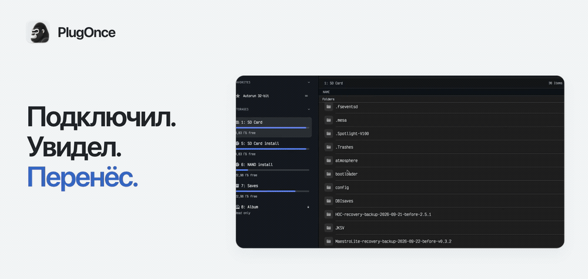
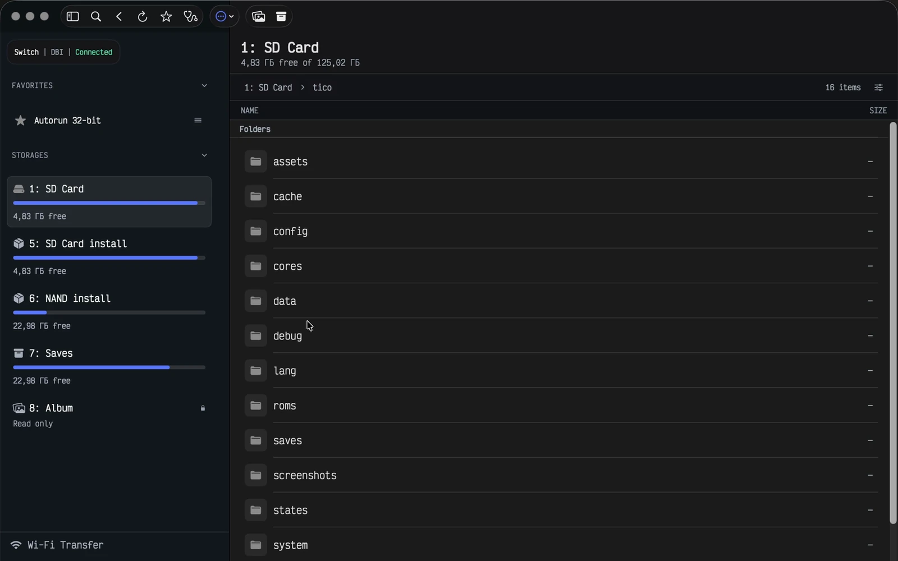
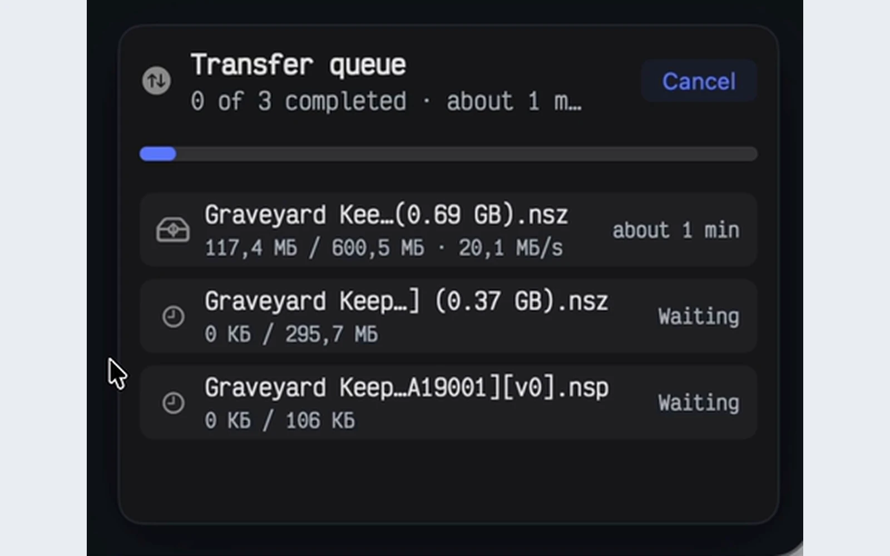
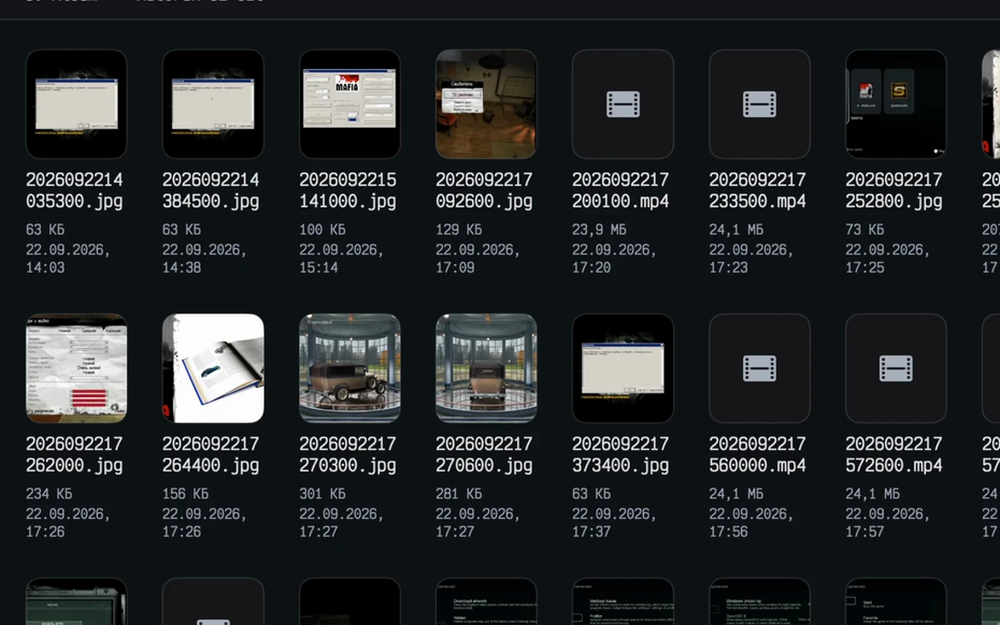
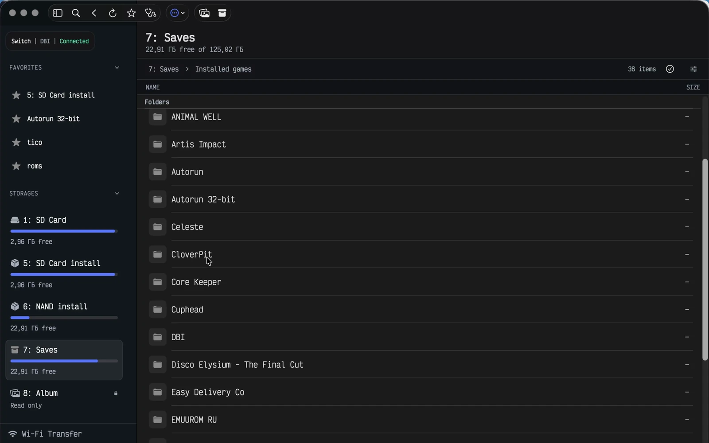

**Русский** · [English](README.md)

# PlugOnce

Нативное приложение для macOS: передавайте файлы между Mac и Nintendo Switch по USB. Открывайте хранилища DBI, отправляйте пакеты, импортируйте альбом и сохраняйте копии сохранений.

  <a href="#overview"><picture>
      <source media="(prefers-reduced-motion: reduce) and (prefers-color-scheme: dark)" srcset="assets/hero-ru-dark.png">
      <source media="(prefers-reduced-motion: reduce)" srcset="assets/hero-ru.png">
      <source media="(prefers-color-scheme: dark)" srcset="assets/hero-ru-dark.gif">
      
    </picture></a>

  <a href="https://plugonce.foxset.tech/?lang=ru"><picture><source media="(prefers-color-scheme: dark)" srcset="assets/download-ru-dark.svg"></picture></a>
  <a href="https://plugonce.foxset.tech/guide?lang=ru"><picture><source media="(prefers-color-scheme: dark)" srcset="assets/guide-ru-dark.svg"></picture></a>
  <a href="https://forum.foxset.tech/"><picture><source media="(prefers-color-scheme: dark)" srcset="assets/support-ru-dark.svg"></picture></a>

macOS 12+ · Apple Silicon + Intel · USB / DBI MTP · English / Русский

<a href="assets/hero-ru.png">Обложка без анимации</a>

> **Публичная beta.** У текущей сборки нет нотарификации Apple. Версия и сведения о загрузке — на [официальном сайте](https://plugonce.foxset.tech/?lang=ru).

## Посмотрите обзор

49 секунд · Запись работы PlugOnce.

https://github.com/user-attachments/assets/33d4689e-239f-4183-9313-531b25bc4b2c

## Файлы, пакеты, альбом и сохранения

<table>
  <tr>
    <td width="50%" valign="top">
      
      <h3>Файлы</h3>
      
Открывайте SD-карту, находите папки и переносите файлы между Mac и Switch.

      <a href="#files">▶ Смотреть · 0:15</a>
    </td>
    <td width="50%" valign="top">
      
      <h3>Пакеты</h3>
      
Отправляйте NSP, NSZ, XCI и XCZ в DBI и следите за ходом каждой передачи.

      <a href="#packages">▶ Смотреть · 0:16</a>
    </td>
  </tr>
  <tr>
    <td width="50%" valign="top">
      
      <h3>Снимки и видео</h3>
      
Смотрите снимки и видео через Quick Look и импортируйте новые кадры.

      <a href="#captures">▶ Смотреть · 0:14</a>
    </td>
    <td width="50%" valign="top">
      
      <h3>Копии сохранений</h3>
      
Копируйте доступные через DBI сохранения в папку с датой на Mac.

      <a href="#saves">▶ Смотреть · 0:17</a>
    </td>
  </tr>
</table>

<strong>▶ Файлы</strong> · 0:15

https://github.com/user-attachments/assets/48f87b4b-fdc3-4489-8d09-4e3bf863a4ca

[Субтитры](media/files.ru.vtt)

<strong>▶ Пакеты</strong> · 0:16

https://github.com/user-attachments/assets/60fc0fde-c947-49a4-8da0-5084afa50f0d

[Субтитры](media/packages.ru.vtt)

<strong>▶ Снимки и видео</strong> · 0:14

https://github.com/user-attachments/assets/7336b7a6-73d3-449b-a9df-e077c1d7fd6f

[Субтитры](media/captures.ru.vtt)

<strong>▶ Копии сохранений</strong> · 0:17

https://github.com/user-attachments/assets/494dfc2a-992d-461a-9be3-333949db22ac

[Субтитры](media/saves.ru.vtt)

## Три шага до подключения

1. [Скачайте PlugOnce](https://plugonce.foxset.tech/?lang=ru) и откройте на Mac с **macOS 12 или новее**. Поддерживаются Apple Silicon и Intel.
2. На Switch откройте **DBI → Run MTP responder / Запустить MTP соединение**. Подключите консоль к Mac USB-кабелем с передачей данных.
3. Выберите хранилище в PlugOnce. Открывайте папки, перетаскивайте в них файлы или копируйте выбранное на Mac.

**Нужны только снимки и видео?** На Switch откройте **Системные настройки → Управление данными → Управление скриншотами и видеозаписями → Копирование на компьютер через USB**. Для этого режима альбома DBI не нужен.

[Полная инструкция подключения →](https://plugonce.foxset.tech/guide?lang=ru)

## Ещё несколько удобств

- **Избранное и горячие клавиши** для частых папок и действий.
- **Device Doctor** показывает, на каком этапе возникла проблема с подключением.
- **Передача по локальному Wi-Fi** через браузер, пока PlugOnce открыт.
- **Светлая и тёмная темы**, русский и английский интерфейсы.

<strong>Raycast и локальные AI-агенты</strong>

Agent Access позволяет локальным инструментам искать файлы, читать избранное и готовить передачу. Вы выбираете разрешённые папки и действия в PlugOnce; по умолчанию запись требует подтверждения в приложении. Raycast использует тот же доступ. Для установки расширения пока нужна локальная копия: публичный архив не опубликован.

[Инструкция Agent Access](https://plugonce.foxset.tech/AI_AGENTS.md) · [Настройка Raycast](https://plugonce.foxset.tech/RAYCAST.md)

<strong>Перед началом</strong>

Для сценариев DBI нужна консоль, на которой уже можно запустить DBI. Завершённая отправка пакета означает передачу данных в DBI; результат установки проверяйте на консоли. Резервная копия содержит данные, доступные через DBI. После обрыва передача начинается заново.

## Вопросы и обратная связь

Заходите на [форум PlugOnce](https://forum.foxset.tech/). Если не получается подключиться, укажите версии PlugOnce и macOS и этап, который показывает Device Doctor.

---

В этом репозитории собраны публичные деморолики и документация. Приложение PlugOnce распространяется отдельно.
